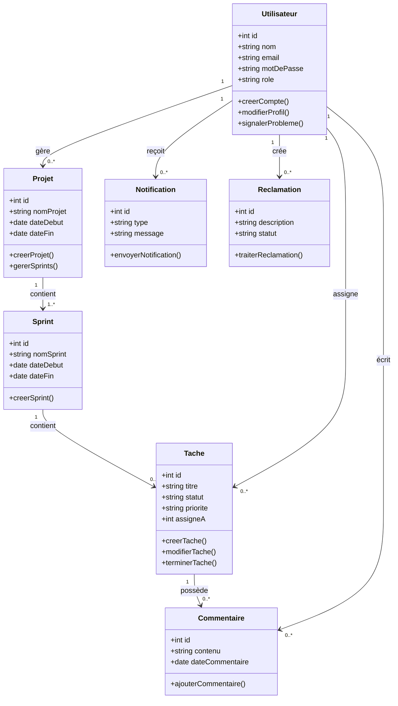
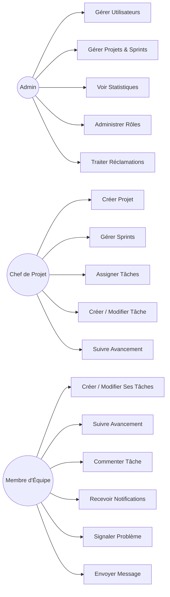

```mermaid
classDiagram
    class Utilisateur {
        +int id
        +string nom
        +string email
        +string motDePasse
        +string role
        +creerCompte()
        +modifierProfil()
        +signalerProbleme()
    }

    class Projet {
        +int id
        +string nomProjet
        +date dateDebut
        +date dateFin
        +creerProjet()
        +gererSprints()
    }

    class Sprint {
        +int id
        +string nomSprint
        +date dateDebut
        +date dateFin
        +creerSprint()
    }

    class Tache {
        +int id
        +string titre
        +string statut
        +string priorite
        +int assigneA
        +creerTache()
        +modifierTache()
        +terminerTache()
    }

    class Commentaire {
        +int id
        +string contenu
        +date dateCommentaire
        +ajouterCommentaire()
    }

    class Notification {
        +int id
        +string type
        +string message
        +envoyerNotification()
    }

    class Reclamation {
        +int id
        +string description
        +string statut
        +traiterReclamation()
    }

    %% Relations
    Utilisateur "1" --> "0..*" Projet : gère
    Projet "1" --> "1..*" Sprint : contient
    Sprint "1" --> "0..*" Tache : contient
    Utilisateur "1" --> "0..*" Tache : assigne
    Tache "1" --> "0..*" Commentaire : possède
    Utilisateur "1" --> "0..*" Commentaire : écrit
    Utilisateur "1" --> "0..*" Notification : reçoit
    Utilisateur "1" --> "0..*" Reclamation : crée

```

```mermaid 
flowchart LR
    Admin((Admin))
    Chef((Chef de Projet))
    Membre((Membre d'Équipe))

    Admin --> GU[Gérer Utilisateurs]
    Admin --> GP[Gérer Projets & Sprints]
    Admin --> VS[Voir Statistiques]
    Admin --> AR[Administrer Rôles]
    Admin --> TR[Traiter Réclamations]

    Chef --> CP[Créer Projet]
    Chef --> GS[Gérer Sprints]
    Chef --> AT[Assigner Tâches]
    Chef --> MT[Créer / Modifier Tâche]
    Chef --> SA[Suivre Avancement]

    Membre --> CT[Créer / Modifier Ses Tâches]
    Membre --> ST[Suivre Avancement]
    Membre --> CM[Commenter Tâche]
    Membre --> RN[Recevoir Notifications]
    Membre --> SP[Signaler Problème]
    Membre --> EM[Envoyer Message]

```
